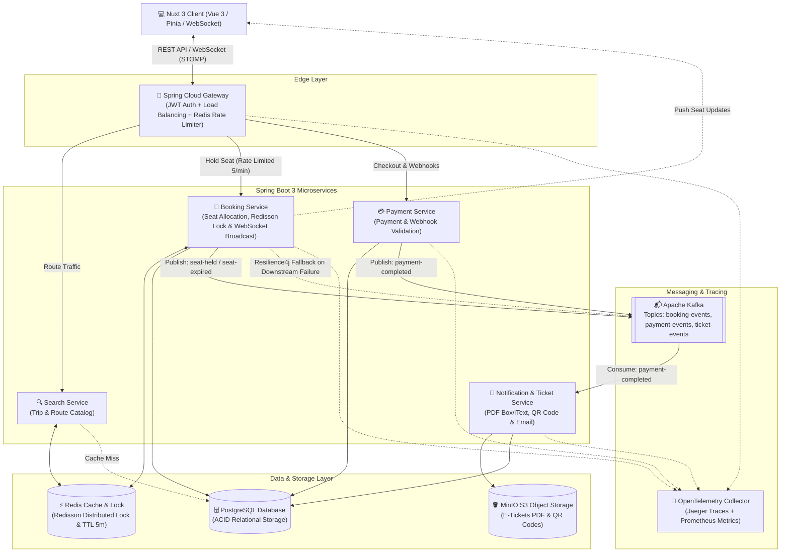
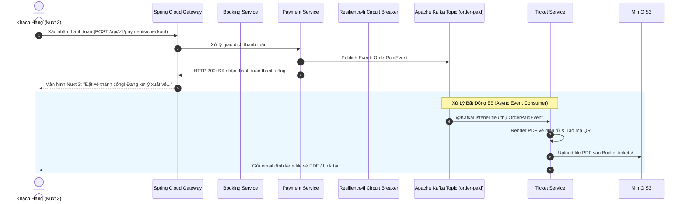

# 🚆 Real-Time Ticket Booking System

### Hệ Thống Đặt Vé Xe Khách / Tàu Hỏa Thời Gian Thực

[](#-2-công-nghệ-sử-dụng-tech-stack)
[](#-2-công-nghệ-sử-dụng-tech-stack)
[](#-2-công-nghệ-sử-dụng-tech-stack)
[](#-44-circuit-breaker--bất-đồng-bộ-với-apache-kafka)
[](#-41-xử-lý-concurrency--double-booking-redisson-lock)
[](#-45-lưu-trữ-vé-điện-tử-minio--s3)
[](#-46-distributed-tracing--monitoring)

---

## 📖 1. Giới Thiệu & Mô Tả Bài Toán

Hệ thống **Real-Time Ticket Booking System** là một giải pháp kiến trúc Microservices phân tán phục vụ bài toán bán vé xe khách / tàu hỏa vào các dịp cao điểm (lễ, Tết, mở bán chặng hot). Hệ thống được thiết kế tối ưu cho:

- **Thời gian thực (Real-time):** Trạng thái ghế ngồi cập nhật tức thời hai chiều qua **WebSocket** về giao diện người dùng Nuxt 3.
- **Khối lượng ghi cực lớn (Write-heavy):** Hàng chục nghìn lượt người dùng cùng tranh chấp giữ chỗ tại một thời điểm mở bán.
- **Xử lý sự kiện bất đồng bộ cao (Event-Driven Architecture):** Tách rời các tác vụ nặng (sinh mã QR, render PDF vé, gửi email) khỏi luồng thanh toán chính qua **Apache Kafka** để đảm bảo SLA phản hồi nhanh nhất.

### 🎯 Yêu Cầu Tính Năng Cốt Lõi

1. **Tìm kiếm chuyến đi:** Tra cứu tuyến đường, lịch trình, giá vé với độ trễ cực thấp (< 50ms nhờ Cache-Aside trên Redis).
2. **Giữ chỗ tạm thời (Hold Seat):** Cho phép người dùng giữ ghế trong **5 phút**. Quá thời gian quy định không thanh toán, hệ thống sẽ tự động hoàn trả ghế về trạng thái trống (TTL Auto-release) và phát tín hiệu qua WebSocket.
3. **Chống trùng ghế (Zero Double-Booking):** Đảm bảo tuyệt đối không có 2 khách hàng nào giữ/đặt trùng một ghế tại cùng một thời điểm dưới tải đồng thời cao (High Concurrency) bằng **Redisson Distributed Lock**.
4. **Xuất vé điện tử tự động:** Tự động tạo file PDF vé kèm mã QR định danh sau khi thanh toán thành công, lưu trữ dài hạn vào **MinIO S3** và hỗ trợ tải về mọi lúc.

---

## 💻 2. Công Nghệ Sử Dụng (Tech Stack)

| Tầng Kiến Trúc               | Công Nghệ / Thư Viện                                                       | Mục Đích Sử Dụng                                                                                                                    |
| :--------------------------- | :------------------------------------------------------------------------- | :---------------------------------------------------------------------------------------------------------------------------------- |
| **Frontend**                 | **Nuxt 3** (Vue 3, TypeScript, Pinia, TailwindCSS, Nitro)                  | Giao diện SSR/SSG thân thiện SEO, cập nhật sơ đồ ghế trực quan hai chiều qua WebSocket client, quản lý state giỏ vé bằng Pinia.     |
| **API Gateway**              | **Spring Cloud Gateway** + Spring Security (JWT)                           | Single entry-point định tuyến traffic, xác thực tập trung, Rate Limiting (Redis Token Bucket).                                      |
| **Backend Framework**        | **Spring Boot 3** (Java 17/21)                                             | Xây dựng các Microservices hiệu năng cao, Spring Data JPA, Spring WebSocket (STOMP).                                                |
| **Real-time Engine**         | **Spring WebSocket + STOMP / Redis PubSub**                                | Kênh truyền thông tin hai chiều theo thời gian thực để đồng bộ trạng thái khóa/nhả ghế giữa tất cả các client đang xem cùng chuyến. |
| **Message Broker**           | **Apache Kafka** (Kraft Mode)                                              | Xương sống Event-Driven, luân chuyển event đặt vé, thanh toán, nhả ghế và xuất vé bất đồng bộ.                                      |
| **Distributed Lock & Cache** | **Redis (Cluster/Standalone)** + **Redisson**                              | Cache thông tin chuyến đi, quản lý TTL giữ ghế 5 phút, khóa phân tán Redlock chống Double Booking.                                  |
| **Primary Database**         | **PostgreSQL** (hoặc MySQL 8.0)                                            | Lưu trữ quan hệ ACID (Chuyến đi, Sơ đồ ghế, Đơn hàng, Vé điện tử).                                                                  |
| **Object Storage**           | **MinIO** (S3-Compatible Object Storage)                                   | Lưu trữ file PDF vé điện tử và ảnh QR Code định danh, cung cấp Presigned URL tải file an toàn.                                      |
| **Fault Tolerance**          | **Resilience4j**                                                           | Circuit Breaker, Retry, Rate Limiter bảo vệ dịch vụ khỏi Cascading Failures.                                                        |
| **Observability**            | **OpenTelemetry**, **Jaeger**, **Prometheus**, **Grafana**, **Micrometer** | Thu thập Trace phân tán end-to-end, đo đạc latency từng Span, cảnh báo metric tài nguyên và lỗi.                                    |
| **DevOps & Container**       | **Docker**, **Docker Compose**                                             | Đóng gói môi trường và khởi chạy hạ tầng đồng bộ cục bộ/production.                                                                 |

---

## 🏗️ 3. Kiến Trúc Tổng Thể (Microservices Architecture)



### 🧩 Chi Tiết Các Service & Trách Nhiệm

| Service             | Công Nghệ                                       | Trách Nhiệm Chi Tiết                                                                                                                               |
| :------------------ | :---------------------------------------------- | :------------------------------------------------------------------------------------------------------------------------------------------------- |
| **API Gateway**     | Spring Cloud Gateway, Spring Security           | Định tuyến request, xác thực JWT claim, chuyển tiếp kết nối WebSocket, áp dụng Redis Token Bucket Rate Limiting cho API nhạy cảm.                  |
| **Search Service**  | Spring Boot 3, Spring Data Redis                | Tra cứu chuyến xe/tàu, áp dụng chiến lược Cache-Aside giảm tải 95% cho Database.                                                                   |
| **Booking Service** | Spring Boot 3, Redisson, WebSocket (STOMP), JPA | Quản lý sơ đồ ghế, thực thi Redisson Lock chống Double Booking, quản lý thời gian giữ chỗ 5 phút (TTL), broadcast trạng thái ghế qua WebSocket.    |
| **Payment Service** | Spring Boot 3, Kafka Producer                   | Xử lý thanh toán, xác thực Webhook bên thứ 3 (VNPay/MoMo/Stripe) đảm bảo tính lũy thừa (Idempotency).                                              |
| **Ticket Service**  | Spring Boot 3, Kafka Consumer, OpenPDF/iText    | Tiêu thụ event thanh toán từ Kafka, render file PDF vé điện tử, tạo mã QR, upload lên MinIO và gửi email.                                          |
| **Nuxt 3 Frontend** | Nuxt 3, Vue 3, Pinia, TailwindCSS               | Giao diện thời gian thực, hiển thị sơ đồ ghế động cập nhật tức thời qua WebSocket, đếm ngược thời gian giữ chỗ (Countdown Timer 5:00), tải vé PDF. |

---

## ⚡ 4. Các Giải Pháp Kỹ Thuật Trọng Tâm

### 🔒 4.1. Xử Lý Concurrency & Double Booking (Redisson Lock)

Khi hàng trăm người dùng cùng bấm chọn một ghế tại cùng một millisecond, hệ thống giải quyết tranh chấp bằng **Redisson Distributed Lock** trên Redis theo các bước:

1. **Khởi tạo khóa:** Tạo Distributed Lock với Key phân tán theo cấu trúc `lock:seat:{tripId}:{seatNumber}`.
2. **Cơ chế Try-Lock an toàn:** Sử dụng `tryLock` với thời gian chờ lấy khóa (Wait Time ~3 giây) và thời gian tự động giải phóng (Lease Time ~5 giây) để loại trừ hoàn toàn rủi ro Deadlock.
3. **Kiểm tra trạng thái & Đặt giữ chỗ:** Sau khi giành được Lock, kiểm tra trạng thái ghế trên Redis/Database. Nếu ghế còn trống, gán key `hold:seat:{tripId}:{seatNumber}` kèm thời gian sống (TTL) đúng 5 phút (300 giây).
4. **Phát tín hiệu Real-time:** Đẩy thông báo ghế đã chuyển sang trạng thái "Đang giữ chỗ" qua WebSocket đến toàn bộ client đang theo dõi cùng chuyến xe.
5. **Giải phóng khóa an toàn:** Thực hiện unlock an toàn trong khối dọn dẹp tài nguyên (chỉ luồng đang giữ lock mới có quyền giải phóng).

---

### ⏳ 4.2. Cơ Chế Giữ Chỗ 5 Phút (TTL & Auto-Release)

Trạng thái ghế được đánh dấu `HELD` với thời hạn chính xác **5 phút (300s)**.

- **Luồng xử lý tự động:**
  1. **Kafka Delayed Event / Dead Letter Queue:** Khi tạo phiên giữ ghế, Booking Service gửi sự kiện `SeatHoldInitiatedEvent` chứa thông tin hết hạn (`expiresAt = now + 5 min`).
  2. **Worker Expiration Consumer:** Consumer nhận sự kiện sau 5 phút và kiểm tra trạng thái đơn hàng:
     - Nếu đơn hàng vẫn ở trạng thái `PENDING_PAYMENT` (chưa thanh toán): Cập nhật đơn thành `EXPIRED`, xóa key `hold:seat:{tripId}:{seatNumber}` khỏi Redis.
     - Phát tín hiệu broadcast qua **WebSocket** về Nuxt 3 Client để cập nhật lại ghế về trạng thái màu xanh (Trống).

---

### 🛡️ 4.3. API Gateway & Rate Limiting Khắt Khe (Spring Cloud Gateway)

Để chống tình trạng bot cào vé, script spam click hoặc người dùng F5 liên tục tại thời điểm mở bán:

- **Endpoint áp dụng:** `POST /api/v1/bookings/hold`
- **Chiến lược:** Áp dụng bộ lọc `RequestRateLimiter` của Spring Cloud Gateway dựa trên thuật toán **Redis Token Bucket**.
- **Chính sách giới hạn:**
  - Định danh theo User ID (đã đăng nhập) hoặc IP Client (khách vãng lai).
  - Tốc độ nạp (Replenish Rate): 5 token / phút.
  - Dung lượng tối đa (Burst Capacity): 5 request cùng lúc.
- **Phản hồi vi phạm:** Khi vượt quá hạn mức, Gateway lập tức trả về mã HTTP `429 Too Many Requests` kèm header `Retry-After: 60`, chặn request ngay tại Gateway mà không gây tải cho Booking Service.

---

### 🧯 4.4. Circuit Breaker & Bất Đồng Bộ Với Apache Kafka

Khi lượng khách thanh toán ồ ạt, việc tạo file PDF vé và gửi email rất dễ gây nghẽn hệ thống. Kiến trúc sử dụng **Resilience4j Circuit Breaker** kết hợp **Apache Kafka**:



- **Resilience4j Circuit Breaker & Fallback:**
  - Circuit Breaker giám sát tỷ lệ lỗi và độ trễ khi Booking/Payment giao tiếp với downstream services.
  - Nếu downstream bị chậm hoặc gián đoạn, Circuit Breaker tự động chuyển sang trạng thái `OPEN` và kích hoạt Fallback: chuyển toàn bộ yêu cầu sang Kafka Topic `order-paid`.
  - Giúp trả về kết quả thành công cho người dùng ngay lập tức, trong khi worker sẽ tiêu thụ và xử lý xuất vé khi dịch vụ hồi phục.

---

### 🪣 4.5. Lưu Trữ Vé Điện Tử (MinIO / S3)

- File PDF vé và mã QR định danh sau khi render được đẩy trực tiếp lên **MinIO Object Storage**.
- **Cấu trúc lưu trữ:** `bucket-tickets/trips/{trip_id}/{ticket_code}.pdf`
- **Tối ưu hiệu năng:** Cung cấp **Presigned URL** tải vé có hiệu lực giới hạn thời gian (ví dụ: 15 phút) cho Nuxt 3 Client. Khách hàng có thể mở lại vé bất kỳ lúc nào mà máy chủ không cần render lại PDF.

---

### 🔭 4.6. Distributed Tracing & Monitoring

```
[Nuxt 3 Client] ──> [Spring Gateway] ──> [Booking Service] ──> [Redisson Lock] ──> [PostgreSQL]
       │                    │                    │                     │                │
       └────────────────────┴────────────────────┴─────────────────────┴────────────────┘
                                                ▼
                         OpenTelemetry Trace ID: 4bf92f3577b34da6a3ce929d0e0e4736
```

1. **Prometheus & Grafana:**
   - **Hold Success Rate:** Đo tỷ lệ % giữ chỗ thành công theo thời gian thực.
   - **Kafka Consumer Lag:** Đo độ trễ số lượng message xuất vé chưa được xử lý.
   - **JVM & Resource Metrics:** Theo dõi Heap Memory, Thread Count, CPU của các Spring Boot Services.
2. **OpenTelemetry & Jaeger:**
   - Theo dõi từng Span trong toàn bộ vòng đời request từ Gateway -> Service -> Redis -> DB.
   - Dễ dàng phát hiện điểm nghẽn (bottleneck) về độ trễ khi chịu tải lớn.

---

## 🗄️ 5. Thiết Kế Cơ Sở Dữ Liệu & Redis Keys

### 🗃️ Mô Hình Dữ Liệu Quan Hệ (PostgreSQL)

| Bảng Dữ Liệu     | Khóa Chính  | Trường Quan Trọng                                                                                                  | Mô Tả Nghiệp Vụ                                                                                |
| :--------------- | :---------- | :----------------------------------------------------------------------------------------------------------------- | :--------------------------------------------------------------------------------------------- |
| **`trips`**      | `id` (UUID) | `trip_code`, `route_name`, `departure_time`, `arrival_time`, `available_seats`, `price`                            | Quản lý thông tin tuyến đường, lịch trình và số lượng chỗ ngồi còn lại.                        |
| **`trip_seats`** | `id` (UUID) | `trip_id`, `seat_number`, `status` (AVAILABLE, HELD, BOOKED), `held_by_user_id`, `held_until`, `version`           | Quản lý trạng thái từng ghế của mỗi chuyến đi, hỗ trợ Optimistic Locking qua trường `version`. |
| **`bookings`**   | `id` (UUID) | `booking_code`, `user_id`, `trip_id`, `status` (PENDING_PAYMENT, CONFIRMED, EXPIRED), `total_amount`, `expires_at` | Lưu thông tin đơn đặt vé và thời hạn thanh toán (5 phút).                                      |
| **`tickets`**    | `id` (UUID) | `booking_id`, `ticket_number`, `qr_code_url`, `pdf_storage_path`, `issued_at`                                      | Lưu thông tin vé điện tử đã xuất và đường dẫn file lưu trữ trên MinIO S3.                      |

### ⚡ Thiết Kế Redis Keys

| Loại Key               | Định Dạng Key                       | Ý Nghĩa / TTL                                          |
| :--------------------- | :---------------------------------- | :----------------------------------------------------- |
| **Distributed Lock**   | `lock:seat:{trip_id}:{seat_number}` | Redisson Lock chống tranh chấp chọn ghế (`TTL: 5s`)    |
| **Seat Hold Status**   | `hold:seat:{trip_id}:{seat_number}` | Lưu User ID và Booking ID đang giữ ghế (`TTL: 300s`)   |
| **User Rate Limit**    | `request_rate_limiter.{user_id}`    | Spring Cloud Gateway Token Bucket counter (`TTL: 60s`) |
| **Trip Catalog Cache** | `cache:trip:{trip_id}:details`      | Cache thông tin chuyến & sơ đồ ghế (`TTL: 30s`)        |

---

## 📡 6. Danh Sách API Endpoints Chính

| Method | Endpoint                        | Mô Tả                                                          | Rate Limit            |
| :----- | :------------------------------ | :------------------------------------------------------------- | :-------------------- |
| `GET`  | `/api/v1/trips/search`          | Tra cứu chuyến theo điểm đi, điểm đến, ngày khởi hành          | 100 req/min           |
| `GET`  | `/api/v1/trips/{id}/seats`      | Lấy danh sách sơ đồ ghế & trạng thái thời gian thực            | 60 req/min            |
| `WS`   | `/ws/trips/{id}/seats`          | Kênh WebSocket nhận broadcast thay đổi trạng thái ghế realtime | WebSocket Connection  |
| `POST` | `/api/v1/bookings/hold`         | Giữ chỗ ghế trong 5 phút (Áp dụng Redisson Lock)               | **5 req/min/user** ⚠️ |
| `POST` | `/api/v1/payments/checkout`     | Khởi tạo giao dịch thanh toán cho đơn giữ chỗ                  | 10 req/min            |
| `POST` | `/api/v1/payments/webhook`      | Webhook tiếp nhận kết quả từ Cổng Thanh Toán (Idempotency)     | No-limit (HMAC Check) |
| `GET`  | `/api/v1/tickets/{id}/download` | Lấy Presigned URL tải file PDF vé điện tử từ MinIO             | 30 req/min            |

---

## 📁 7. Cấu Trúc Thư Mục Dự Án (Monorepo)

```text
ticket-booking-system/
├── frontend/                          # Nuxt 3 Client Application
│   ├── app.vue
│   ├── pages/                         # Trang tìm kiếm chuyến, chọn ghế, thanh toán
│   ├── components/seat-map/           # Component sơ đồ ghế trực quan thời gian thực
│   ├── stores/                        # Pinia Store quản lý state giỏ vé & countdown
│   ├── composables/                   # WebSocket Hook (STOMP Client) nhận event trạng thái ghế
│   └── nuxt.config.ts
├── backend/                           # Spring Boot 3 Microservices (Multi-module Maven)
│   ├── pom.xml
│   ├── common-library/                # Shared DTOs, Kafka Events, Exceptions, OTel Config
│   ├── api-gateway/                   # Spring Cloud Gateway, JWT Auth, Redis Rate Limiter, WS Routing
│   ├── search-service/                # Search & Catalog Service (Redis Cache-aside)
│   ├── booking-service/               # Booking, Redisson Lock & WebSocket Broadcast Service
│   ├── payment-service/               # Payment gateway integration & Webhook handler
│   └── ticket-service/                # Kafka Consumer, PDF rendering & MinIO S3 upload
├── deployments/
│   ├── docker/
│   │   ├── docker-compose.yml         # Môi trường chạy full stack (Kafka, Redis, Postgres, MinIO...)
│   │   └── Dockerfile.*
│   ├── prometheus/                    # Cấu hình Prometheus metrics & alerts
│   ├── grafana/                       # Dashboards giám sát Kafka lag & System Latency
│   └── minio/                         # Script khởi tạo bucket mặc định
└── README.md
```

---

## 🚀 8. Hướng Dẫn Khởi Chạy Nhanh (Local Development)

### 📋 Yêu Cầu Môi Trường

- **JDK 17** hoặc **JDK 21** & **Maven 3.9+**
- **Node.js 18+** & **pnpm / npm**
- **Docker** (>= 24.0) & **Docker Compose** (>= 2.20)

### 🛠️ Các Bước Cài Đặt

1. **Clone repository:**

   ```bash
   git clone https://github.com/hiepdev582/Ticket_Booking_System.git
   cd Ticket_Booking_System
   ```

2. **Khởi chạy hạ tầng qua Docker Compose (Kafka, Redis, PostgreSQL, MinIO, OTel, Prometheus, Grafana):**

   ```bash
   docker compose -f deployments/docker/docker-compose.yml up -d
   ```

3. **Khởi chạy Backend Microservices (Spring Boot):**

   ```bash
   cd backend
   mvn clean install -DskipTests
   # Chạy từng service hoặc qua profile docker
   mvn --projects api-gateway spring-boot:run
   ```

4. **Khởi chạy Frontend (Nuxt 3):**

   ```bash
   cd ../frontend
   npm install
   npm run dev
   ```

   _Frontend sẽ chạy tại:_ `http://localhost:3000`

5. **Truy cập các Dashboard quản trị & giám sát:**
   - **Nuxt 3 Web App:** `http://localhost:3000`
   - **API Gateway:** `http://localhost:8080`
   - **MinIO Console:** `http://localhost:9001` (User: `minioadmin` / Pass: `minioadmin`)
   - **Kafka UI:** `http://localhost:8085`
   - **Jaeger Tracing UI:** `http://localhost:16686`
   - **Grafana Monitoring:** `http://localhost:3001` (admin / admin)

6. **Kịch bản kiểm thử Concurrency (Chống Double Booking với K6):**
   ```bash
   # Bắn 50 requests đồng thời cùng chọn ghế A12
   k6 run tests/load/concurrent_hold_seat.js
   ```
   _Kết quả kỳ vọng:_ Đúng **1 request thành công (HTTP 201)** với Redisson Lock, 49 requests còn lại nhận **HTTP 409 Conflict** hoặc **HTTP 429 Too Many Requests**.

---

## 👨‍💻 Tác Giả & Giấy Phép

- **Tác giả:** [hiepdev582](https://github.com/hiepdev582)
- **Giấy phép:** MIT License
